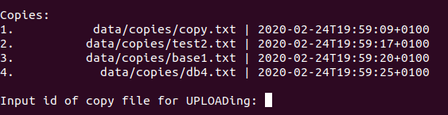
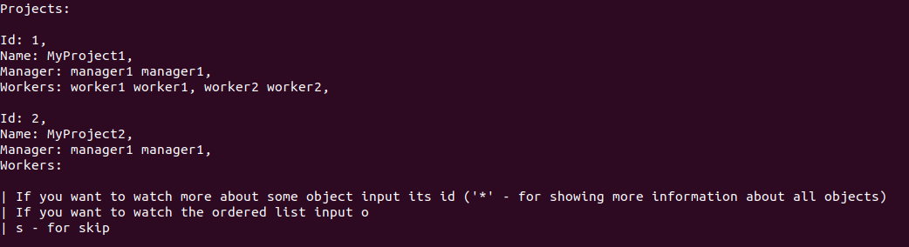

# data_base_files_C

Database managers-workers-projects with loading/saving data from/into files.

Own implementation of json-parsing

.h files contains brief descriptions of purpose of file and functions

!!! You should have folder data/copies in folder with .out file

 
 
 